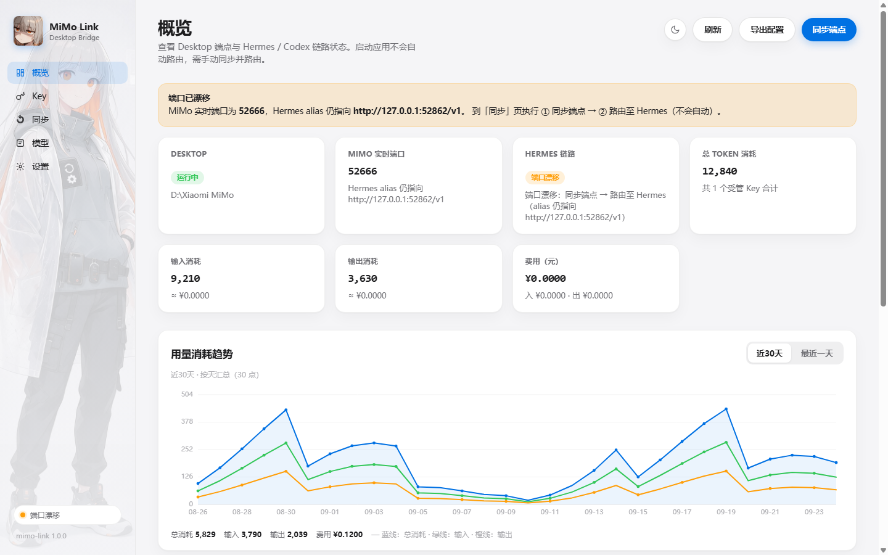

# MiMo Link

受够了 mimo desktop 的无限循环？买了 mimo desktop 订阅，却因为它自带 harness 太差，根本用不起来....甚至模型降智....再加上 token 用量完全不透明，总怕哪天直接用爆。

所以做了 **mimo link**——让 mimo desktop 可以路由到别的 harness 软件！

目前只是 demo 版本，相当于一个小玩具，目前适用于 Codex / Hermes 等工具，zcode 等其它 agent 平台还没测过，能用不能用不好说。

## 界面一览



概览页一屏看完链路状态、token 消耗和用量趋势（近30天 / 最近一天可切换）。

## 能干嘛

- **路由出去**：把 mimo desktop 的本地能力 API 接到 Hermes / Codex，不爽它自己的 harness 就换一个
- **发不同 API Key**：可以给不同客户端发不同的 `mlk_…` Key，并设用量上限，防止 mimo 复读把自己 token 耗光
- **透明用量**：token 用量不再黑盒。概览页有用量折线图，可切换 **近30天（按天）/ 最近一天（半小时一粒）**，输入 / 输出 / 花费一眼看到
- **费用折算**：按定价（元 / 1M tokens）换算成钱，心里有数
- **导出配置**：CC Switch 用的 JSON，复制导入即可

## 使用前提

**这不是反代！** 必须开着 mimo desktop。因为 mimo desktop 本身就自带了一个 llm-server，mimo link 只是把它的本地能力 API 接到别的工具上，直接调用 mimo 大模型。

## 快速开始

```bat
cd app
启动 MiMo Link.bat
```

或者：

```bash
python app/server.py --port 8765 --open
```

打开 `http://127.0.0.1:8765`。

**建议顺序**：先在「同步」页生成 **统一 scoped token** → 再生成 API Key → ① 同步端点 → ② 路由至 Hermes / Codex。启动和同步都**不会**自动改配置，必须自己点「路由」。

## 桌面版（pywebview · 用于 Release）

不想开浏览器的话，可以打成原生窗口程序（内部仍是同一套 UI + 本机服务）：

```powershell
python -m venv .venv
.\.venv\Scripts\pip install -r requirements-desktop.txt

# 开发时直接弹窗运行
.\.venv\Scripts\python app\desktop.py

# 打 Windows 发布包 → dist\MiMoLink\MiMoLink.exe
.\.venv\Scripts\python app\build_desktop.py
```

把 `dist\MiMoLink\` 整个文件夹打成 zip 挂到 GitHub Release 即可。  
界面基于系统 WebView2，无需再装 Chrome。Key / 定价等数据存在 `%LOCALAPPDATA%\mimo-link\`，不会跟着 exe 被覆盖。

## 路由到哪

| 目标 | 做了什么 |
|------|----------|
| Hermes | 写入 `mimo-desktop` 模型别名 |
| Codex | 合并写入 `~/.codex`（`wire_api=responses`，经本机桥接 `:8765`） |

用 Codex 时**本应用要保持运行**——它只认 `wire_api=responses`，MiMo 只有 Chat Completions，中间靠桥接转换转发。

## 本地文件（插件目录，不会提交）

| 文件 | 说明 |
|------|------|
| `mimo-link.env` | 引擎 `MIMO_LLM_SERVER_TOKEN` |
| `mimo-link-keys.json` | 受管 API Key、用量与时间序列 |
| `mimo-link-pricing.json` | 定价（元 / 1M tokens） |

## License

MIT
