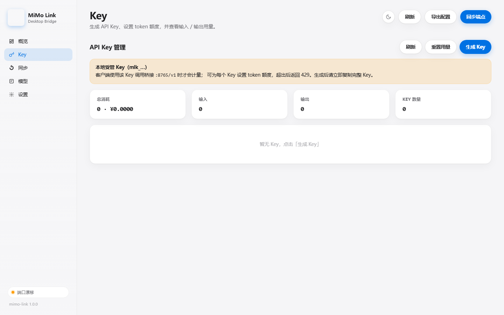
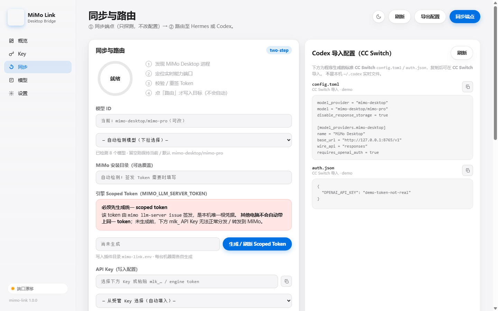

# 受够了 MiMo Desktop 的无限循环？我把它的模型路由给了 Codex / Hermes

> **项目地址：** [https://github.com/crazyjack44/mimo-link](https://github.com/crazyjack44/mimo-link)  
> **License：** MIT

## 为什么要做这个

受够了 mimo desktop 的无限循环？

买了 MiMo Desktop 订阅，却因为它自带 harness 太差，根本用不起来....甚至模型降智....再加上 token 用量完全不透明，总怕哪天直接用爆。

于是做了 **MiMo Link**——让 MiMo Desktop 的模型，可以路由到 **Codex / Hermes** 这些更好用的 harness 上去。

先看一眼界面：


概览页一屏看完：Desktop 是否在跑、实时端口、链路状态、token 消耗，以及**用量折线图**（近30天按天 / 最近一天按半小时可切换）。

---

## 这不是反代

很多人第一反应是：是不是又包了一层反向代理？

**并不是。**

MiMo Desktop 本身就自带了一个本地 **llm-server**，可以直接调用 MiMo 大模型。MiMo Link 做的是：

1. 找到 Desktop 当前会话的**实时能力端口**（每次会话会漂移）
2. 确保引擎 scoped token（`MIMO_LLM_SERVER_TOKEN`）
3. 把这个本地能力 API **接到** Hermes / Codex

所以：**必须开着 MiMo Desktop**。关了它就没有上游模型。

---

## 能干什么

| 功能 | 说明 |
|------|------|
| **路由出去** | 接到 Hermes（写 `mimo-desktop` 别名）或 Codex（`wire_api=responses`，经本机桥接 `:8765`） |
| **分发 API Key** | 不同客户端用不同 `mlk_…` Key，可设 token / 元额度，超了直接 429 |
| **透明用量** | 每个 Key 的入/出 token、费用、时间序列；概览有折线图 |
| **费用折算** | 按定价（元 / 1M tokens）换算成人民币 |
| **导出配置** | 生成 CC Switch 用的 `config.toml` / `auth.json`，复制导入即可 |

### API Key 管理



给不同客户端发不同的 Key，额度用超就拦下来——**防止 mimo 复读把自己 token 耗光**。

### 同步与路由（两步，不会偷偷改配置）



流程故意做成两步：

1. **同步端点**：只探测端口 / Token / 模型，**不写** Hermes 或 Codex 配置  
2. **路由**：你自己点「路由」，才真正落盘

启动、同步都不会自动改配置。端口漂移了，重新 ① → ② 就行。

---

## 快速开始

环境：Windows（目标机器要开着 MiMo Desktop）。

```bat
cd app
启动 MiMo Link.bat
```

或：

```bash
python app/server.py --port 8765 --open
```

浏览器打开 [http://127.0.0.1:8765](http://127.0.0.1:8765)。

**建议顺序：**

1. 「同步」页 → 生成 **统一 scoped token**（`MIMO_LLM_SERVER_TOKEN`）
2. 「Key」页 → 生成 API Key（可设额度）
3. 「同步」页 → ① 同步端点 → ② 路由至 Hermes 或 Codex

### 路由到 Codex 时注意

Codex 只认 `wire_api=responses`，MiMo 只有 Chat Completions。  
中间由本机桥接 `http://127.0.0.1:8765` 做协议转换，**使用 Codex 时请保持 MiMo Link 运行**。

也可以导出 CC Switch 配置，手动导入到 [CC Switch](https://github.com/farion1231/cc-switch)。

---

## 目前的边界（说清楚，免得踩坑）

- **demo / 小玩具阶段**，目前验证过 **Codex / Hermes**
- zcode 等其它 agent 平台**还没测**，能不能用不好说
- 端口随 Desktop 会话漂移，模型答不上来时优先重新「同步 → 路由」
- 状态文件（Key / 定价 / token）在本地插件目录，不上传

---

## 开源

代码全部开源，欢迎提 Issue / PR：

**GitHub：** [https://github.com/crazyjack44/mimo-link](https://github.com/crazyjack44/mimo-link)

如果这个小工具帮你省了一点 token 钱、或者少踩几次复读坑，欢迎点个 **Star** 支持一下。

**License：** MIT
